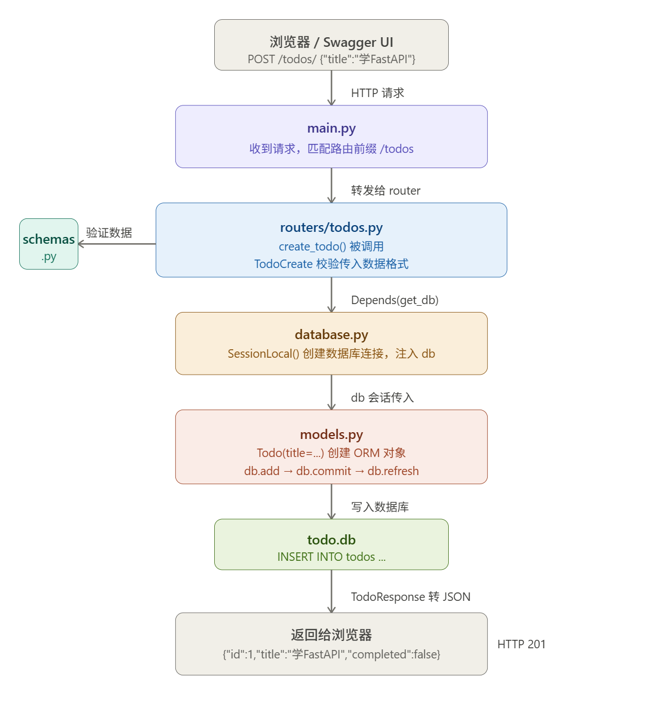

# Todo API

基于 FastAPI + SQLAlchemy + SQLite 的待办事项 REST API。

## 技术栈

- FastAPI 0.135
- SQLAlchemy 2.0
- SQLite
- Pydantic v2
- Uvicorn

## 本地运行

1. 克隆项目

```bash
git clone https://github.com/ItalyPtrick/todo-api.git
cd todo-api
```

2. 安装依赖

```bash
pip install -r requirements.txt
```

3. 配置环境变量

```bash
# 新建 .env 文件
DATABASE_URL=sqlite:///./todo.db
```

4. 启动服务

```bash
uvicorn main:app --reload
```

5. 访问接口文档：http://127.0.0.1:8000/docs

## 接口列表

| 方法   | 路径        | 说明         |
| ------ | ----------- | ------------ |
| POST   | /todos/     | 创建任务     |
| GET    | /todos/     | 获取所有任务 |
| GET    | /todos/{id} | 获取单条任务 |
| PUT    | /todos/{id} | 更新任务     |
| DELETE | /todos/{id} | 删除任务     |

6. 项目脉络
   main.py 组装所有东西，启动服务
   database.py 提供数据库连接
   models.py 定义表结构
   schemas.py 定义输入输出格式
   routers/todos.py 处理具体的增删改查逻辑
   

   比喻每个文件干的事情：
   main.py — 门卫。收到请求，看路径前缀是 /todos，转发给 todos.py 处理。

   routers/todos.py — 大脑。决定调哪个函数，调用 schemas.py 验数据，调用 database.py 拿连接，调用 models.py 操作数据库。

   schemas.py — 检查员。你传来的 JSON 格式对不对，字段类型对不对，不对直接返回 422，不让进。

   database.py — 水管工。负责建立和关闭数据库连接，把连接交给需要它的函数。

   models.py — 翻译官。把你的 Python 操作翻译成 SQL，写进 todo.db 文件。

   todo.db — 仓库。真正存数据的地方，一个本地文件。
